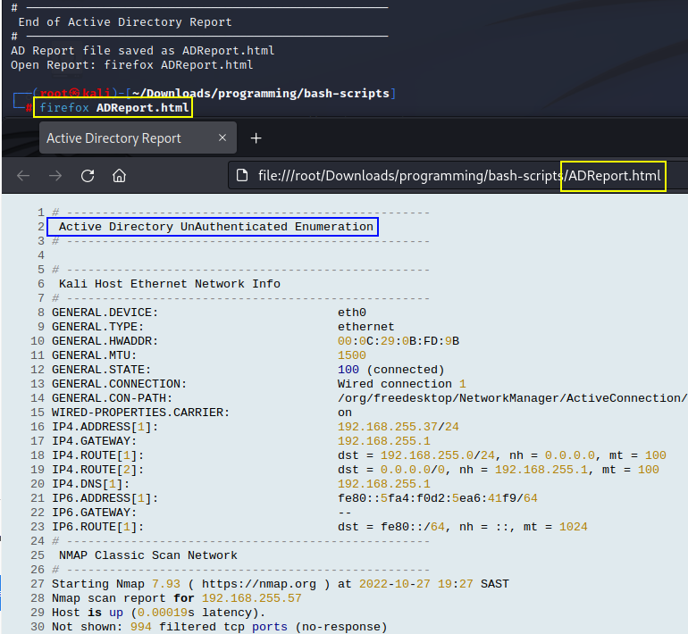

# Active Directory Unauthenticate Enumeration Bash Script

* Work in progress...

A bash script stacked with few enumeration tools to enumerate Active Directory with no crednetials.
The output is piped to text file and then the text file is piped through highlight to produce simple HTML report file.

```bash
chmod +x ad-no-creds-enumeration.sh

./ad-no-creds-enumeration.sh targetlist.txt raw-output.txt

firefox ADReport.html
```
Execution of script with two input arguments, file containing list of target each on seperate line and a output filename.
Then open the save report file ADReport.html.


